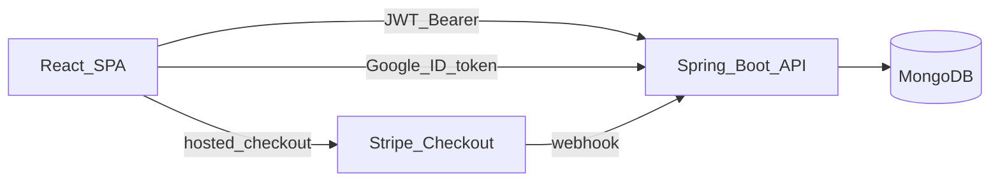
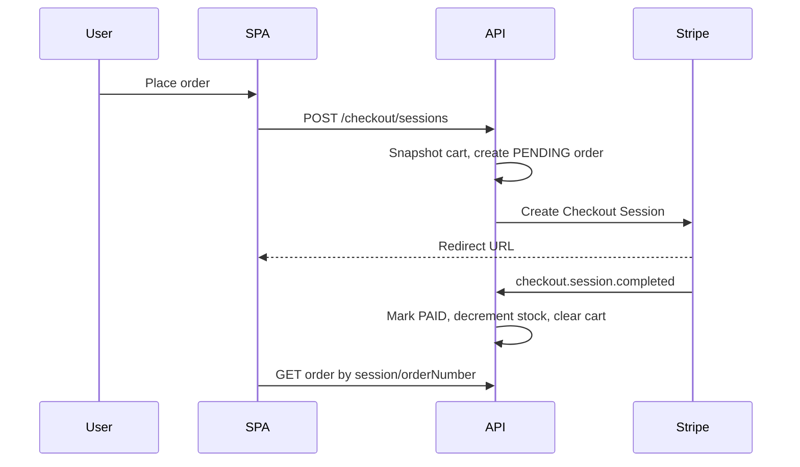

# Harvest &amp; Co. Organic E-Store

Build a production-shaped **basic** organic grocery store: two folders in this workspace (`backend/`, `frontend/`), Docker Compose for MongoDB, Stripe Checkout, and JWT + Google sign-in.

## Stack (latest stable)

- **Java 21 LTS**, **Spring Boot 4.1.1** (Spring Framework 7), Maven
- Boot 4 starters: `spring-boot-starter-webmvc`, `spring-boot-starter-data-mongodb`, `spring-boot-starter-security`, `spring-boot-starter-validation`, `spring-boot-starter-actuator`
- **MongoDB 8** (Docker) + Spring Data MongoDB 5.1 (via Boot BOM)
- **React 19** (latest stable at implement time), **Vite 8**, TypeScript strict
- **Tailwind CSS 4** (`@tailwindcss/vite`), **React Router 7**, **TanStack Query**, **Zustand** (cart)
- **Stripe Checkout** (test mode) + webhook
- Currency: **INR** (configurable)

## Repo layout

```
backend/          Spring Boot API (port 8080)
frontend/         React SPA (port 5173)
docker-compose.yml
.env.example
README.md
```

Keep them as **separate Maven/npm projects** (no parent POM). Shared contract is REST + OpenAPI.

## Architecture



Layering in the API: `controller` → `service` → `repository`. Controllers speak records/DTOs only; Mongo documents stay in `domain`. Global `ProblemDetail` exception handler (RFC 7807). Validation with Jakarta Bean Validation.

## Domain (Mongo collections)

- **users** — email, name, avatar, `passwordHash` (optional), `googleSub`, roles `CUSTOMER` | `ADMIN`, addresses
- **categories** — name, slug, image, sortOrder
- **products** — name, slug, description, pricePaise, images, categoryId, origin, certifications (`USDA Organic`, `India Organic`, etc.), unit (`500g`, `1 bunch`), stock, active, featured
- **carts** — userId or guestToken, items `{productId, qty}`, updatedAt
- **orders** — orderNumber, userId, snapshot line items, shipping address, amounts, `paymentStatus`, `orderStatus`, `stripeSessionId` / `stripePaymentIntentId`

Indexes: unique `users.email`, unique `products.slug`, unique `orders.orderNumber`, text index on product name/description, `products.categoryId + active`.

Stock: decrement atomically on paid webhook (`findAndModify` with `stock >= qty`). Fail the order item if stock races.

## Auth (JWT + Google)

- Email/password register + login → **HS256 JWT** (access 15m + refresh 7d in httpOnly cookie, or both in JSON for SPA simplicity; prefer **access JWT in memory + refresh httpOnly cookie**)
- Google: frontend Google Identity Services button → backend `POST /api/auth/google` verifies ID token against Google JWKS, upserts user, issues same JWT pair
- Roles: `CUSTOMER` default; one seeded admin (`admin@harvest.co` from env)
- Spring Security filter chain: public catalog/auth; authenticated cart/orders; `ADMIN` for `/api/admin/**`

## REST surface

Public: `GET /api/categories`, `GET /api/products` (search, category, featured, page), `GET /api/products/{slug}`

Auth: `POST /api/auth/register|login|google|refresh|logout`

Cart: `GET/POST/PATCH/DELETE /api/cart` (merge guest cart on login)

Checkout: `POST /api/checkout/sessions` → Stripe Checkout Session URL; `POST /api/webhooks/stripe` (raw body + signature)

Orders: `GET /api/orders`, `GET /api/orders/{orderNumber}`

Admin: CRUD products/categories, `GET /api/admin/orders`, `PATCH` status (`CONFIRMED` → `PACKED` → `SHIPPED` → `DELIVERED`)

OpenAPI via `springdoc-openapi` at `/swagger-ui.html`.

## Stripe checkout flow



Use Stripe test keys from `.env`. Success URL: `/order/success?session_id={CHECKOUT_SESSION_ID}`. Cancel: `/cart`.

## Frontend UX (organic, not generic)

Brand: **Harvest &amp; Co.** — cream paper background, forest/olive greens, terracotta accents, serif headlines + clean sans body. Large food photography, generous whitespace, sticky header with search + cart badge.

Customer routes:

- `/` — hero, featured produce, category tiles, “why organic” trust row, testimonials
- `/shop` — grid + filters (category, price, in-stock), search, sort
- `/product/:slug` — gallery, origin, certifications, qty stepper, add-to-cart
- `/cart`, `/checkout` (address then Stripe redirect)
- `/order/success`, `/account/orders`
- `/login`, `/register` (email + Google)

Admin (simple, `/admin/*`, role-gated):

- Products table + create/edit form
- Categories
- Orders list + status update

UI kit: Tailwind 4 + a small set of local components (Button, Input, Card, Badge) — no heavy design system. Accessible: visible focus, alt text, keyboard cart/qty, `aria-live` for add-to-cart. Loading skeletons, empty states, toast errors.

Guest cart in `localStorage`; merge into server cart after login.

## Backend package sketch

`com.harvest.estore` — `config` (Security, CORS, Mongo indexes, Stripe client), `auth`, `catalog`, `cart`, `order`, `admin`, `common` (error, pagination).

Records for DTOs. Services transactional where needed. `CommandLineRunner` seed: ~12 organic SKUs across Produce, Pantry, Dairy, Beverages.

## Config and local run

- `docker-compose.yml`: MongoDB 8 + optional Mongo Express
- `backend/src/main/resources/application.yml`: mongo uri, jwt secret, stripe, google client id, CORS `http://localhost:5173`
- Secrets only in `.env` / user env — never committed
- Frontend Vite proxy `/api` → `8080`
- README: Java 21, Node 22+, Docker, `mvn spring-boot:run`, `npm run dev`

## Tests (keep lean)

- Backend: security filter slice, product search repository, checkout webhook idempotency (same Stripe event twice)
- Frontend: cart store unit tests; no full E2E in v1

## Out of scope for v1

Reviews, wishlist, coupons, inventory reservations, email/SMS, multi-currency, image upload CDN (seed Unsplash/static URLs), SSR.

## Implementation order

1. Scaffold backend + frontend + compose + README
2. Catalog domain, seed, public APIs, shop UI
3. Auth (email + Google) + account shell
4. Cart (guest + logged-in merge)
5. Stripe checkout + webhook + order pages
6. Admin CRUD + order status
7. Polish UX (empty/error/loading, a11y) and verify in browser
