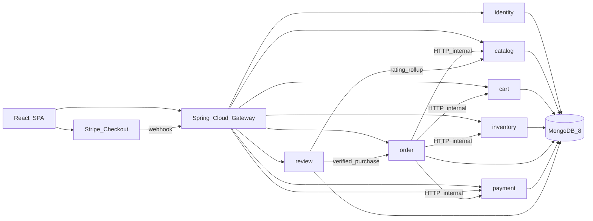
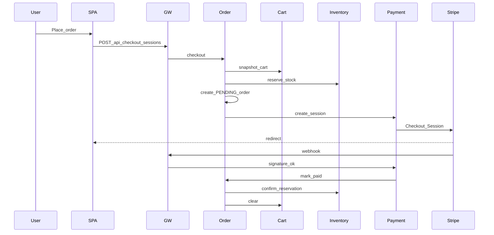

# Harvest & Co. Organic E-Store (Microservices)

Build a production-shaped full store in this empty workspace: **Gateway + 7 domain services + React SPA**. One MongoDB container, **database-per-service**. Add Eureka/Config Server/Kafka in v1 — Docker Compose DNS + env URLs.

## Stack (latest stable, Sep 2026)

- **Java 21 LTS**, **Spring Boot 4.1.1**, Maven multi-module
- **Spring Cloud 2025.1.3 (Oakwood)** — Gateway `5.0.3` via BOM (do not pin Gateway by hand)
- Boot 4 starters: `spring-boot-starter-webmvc`, `data-mongodb`, `security`, `validation`, `actuator`
- Gateway: `spring-cloud-starter-gateway-server-webmvc` (servlet stack, same mental model as services)
- Inter-service: **Spring HTTP Interface + `RestClient`** (not OpenFeign), Resilience4j timeouts/circuit breakers
- **MongoDB 8** (Compose) — separate DBs: `identity`, `catalog`, `cart`, `inventory`, `order`, `payment`, `review`
- **React 19.3**, **Vite 8.2**, TypeScript strict, **Tailwind CSS 4** (`@tailwindcss/vite`), React Router 7, TanStack Query, Zustand
- **Stripe Checkout** (test mode), currency **INR**
- OpenAPI: `springdoc-openapi` on each service; browser talks only to the gateway

## Repo layout

```
pom.xml                     parent BOM (Boot 4.1.1 + Cloud 2025.1.3)
common/                     JWT helpers, ProblemDetail, pagination, internal-key filter
gateway/                    port 8080 — only public entry
identity-service/           8081
catalog-service/            8082
cart-service/               8083
inventory-service/          8084
order-service/              8085   saga orchestrator
payment-service/            8086
review-service/             8087
frontend/                   Vite 5173
docker-compose.yml
.env.example
README.md
```

Shared contract is REST. Mongo documents never leave their service; controllers expose records/DTOs. RFC 7807 `ProblemDetail` globally.

## Architecture




**Security**

- Gateway validates JWT (Nimbus) and sets `X-User-Id`, `X-User-Roles`; strips those headers from the public internet.
- Downstream services trust those headers on the Docker network and require `X-Internal-Key` on `/internal/**`.
- Gateway **does not** route `/internal/`**.
- Stripe webhook: `POST /api/webhooks/stripe` — no JWT, Stripe signature only.
- CORS only on the gateway (`http://localhost:5173`).

**Auth**

- Email/password register + login; access JWT 15m in memory; refresh 7d httpOnly cookie.
- Google Identity Services → `POST /api/auth/google` verifies ID token (JWKS), upserts user, same JWT pair.
- Roles: `CUSTOMER` default; seeded `ADMIN` from env (`admin@harvest.co`).

## Bounded contexts

**identity** — `users`: email (unique), name, avatar, `passwordHash`, `googleSub`, roles, addresses.

**catalog** — `categories` (slug, image, sortOrder); `products` (name, slug unique, description, `pricePaise`, images, categoryId, origin, certifications, unit, active, featured, `averageRating`, `reviewCount`). **No stock field.** Text index on name/description.

**inventory** — `stock` (`productId` unique, `onHand`, `reserved`; available = onHand − reserved); `reservations` (orderId, lines, expiresAt ~15m, PENDING/CONFIRMED/RELEASED). Atomic `findAndModify`. Admin adjustments (receive, damage, recount). Low-stock query for dashboard.

**cart** — `carts`: userId or guestToken, items `{productId, qty}`. Merge guest → user on login. Validates product exists (catalog internal) and available qty (inventory internal).

**order** — `orders`: orderNumber unique, userId, **price/name snapshot** line items, shipping address, amounts, `orderStatus`, `paymentId`, `reservationId`. Status: `PENDING_PAYMENT` → `CONFIRMED` → `PACKED` → `SHIPPED` → `DELIVERED` / `CANCELLED`.

**payment** — `payments` + `processed_events` (Stripe event id unique for idempotency). Creates Checkout Session; webhook marks PAID/FAILED and notifies order via internal API.

**review** — one review per user+product; rating 1–5, body, `verifiedPurchase` (order internal: delivered + line contains product), `VISIBLE`/`HIDDEN`. After write, PATCH catalog rating rollup.

## Checkout saga (order-service orchestrates)




Cancel / Stripe expiry / webhook failure: order cancels, inventory **releases** reservation (TTL sweeper as backup). Stock never decrements until paid.

## REST surface (gateway)

Public: `GET /api/categories`, `GET /api/products` (search, category, featured, page), `GET /api/products/{slug}`, `GET /api/products/{id}/reviews`

Auth: `POST /api/auth/register|login|google|refresh|logout`, `GET/PATCH /api/me`, addresses

Cart: `GET/POST/PATCH/DELETE /api/cart`

Checkout/orders: `POST /api/checkout/sessions`, `GET /api/orders`, `GET /api/orders/{orderNumber}`

Reviews: `POST /api/reviews` (auth)

Webhook: `POST /api/webhooks/stripe`

Admin (`ADMIN` role): product/category CRUD, inventory adjust + low-stock, orders list + status PATCH, payments list, review hide/delete, optional user list

Shop listing availability: catalog batches `GET /internal/stock?productIds=` (circuit-breaker fallback: omit badge rather than fail the page).

## Frontend UX

Brand **Harvest & Co.** — cream paper background, forest/olive greens, terracotta accents, serif headlines + clean sans body. Large produce photography (seed Unsplash URLs), generous whitespace, sticky header with search + cart badge.

Customer routes: `/` hero + featured + category tiles + why-organic + testimonials; `/shop` filters/sort/search; `/product/:slug` gallery, origin, certifications, qty stepper, reviews; `/cart`; `/checkout` address then Stripe redirect; `/order/success`; `/account/orders`; `/login` `/register` (email + Google).

Admin `/admin/*` role-gated: dashboard (orders today, low stock, hidden-review queue), products, inventory, orders, reviews.

UI kit: local Button, Input, Card, Badge, Toast — no heavy design system. A11y: visible focus, alt text, keyboard qty, `aria-live` on add-to-cart. Skeletons, empty/error states. React 19.3 **View Transitions** on shop → product. Guest cart `localStorage`, merge after login.

## Config and local run

- Compose: MongoDB 8, Mongo Express optional, all 8 Java apps + frontend (or run Java via Maven locally against Compose Mongo)
- Secrets only in `.env` (JWT, Google client id, Stripe keys, internal API key, admin password) — never commit
- Frontend Vite proxy `/api` → gateway `:8080`
- README: Java 21, Node 22+, Docker; `docker compose up mongo`; `mvn spring-boot:run` per module or compose `--profile apps`

## Tests (lean)

- Gateway: unauthenticated `/internal` rejected; JWT → user headers
- Inventory: concurrent reserve cannot oversell; release restores available
- Payment: same Stripe event twice is idempotent
- Review: unverified buyer rejected
- Frontend: cart Zustand unit tests

## Out of scope

Kafka/outbox, Eureka, K8s, Spring Cloud Config, email/SMS, coupons, wishlist, image CDN upload, multi-currency, SSR, full E2E.

## Implementation order

1. Parent POM, `common`, Compose Mongo, gateway routing + JWT filter, README
2. Identity + login/register/Google UI
3. Catalog seed (~12 organic SKUs: Produce, Pantry, Dairy, Beverages) + home/shop/PDP
4. Inventory + stock on PDP/shop badges
5. Cart (guest + merge)
6. Order + Payment saga + success/history pages
7. Reviews + rating rollup on PDP
8. Admin dashboard + CRUD/status/moderation
9. UX polish, OpenAPI, browser verification of shop, checkout (Stripe test), admin

